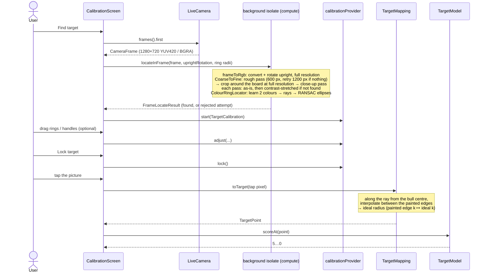
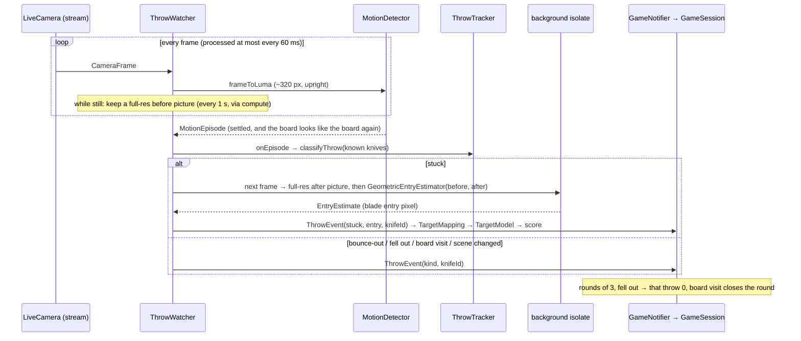

# Data Flow: Camera Frame → Calibration → Score

As built by the target calibration story ([[story-checkpoint-target-calibration]]). Throw detection (next story) will feed the same mapping with a blade's entry point instead of a tap.

## A Throw → a Score (Play)

As built by [[story-checkpoint-throw-detection]].

## Coordinate Spaces

| Space | Where | Notes |
|---|---|---|
| Camera frame | `CameraFrame` | Sensor orientation (usually sideways), 1280 × 720 at `ResolutionPreset.high` |
| Upright image | `RgbImage` from `frameToRgb` | Rotated by `LiveCamera.uprightRotation`; calibration ellipses live here |
| Preview widget | `CalibrationEditor` | Upright image × (preview width ÷ image width); drawn as `CameraPreview`'s child so it lines up |
| Brightness frame | `LumaImage` from `frameToLuma` | Upright, ~320 px long side (180 × 320 portrait from a 1280 × 720 stream); motion detection and stuck/bounce classification; `WatchRegion` is in fractions so it's size-independent |
| Target | `TargetPoint` | Normalised: centre 0,0, outer edge of ring 1 at radius 1, v up; **ideal** ring radii 0.2 … 1.0 |
