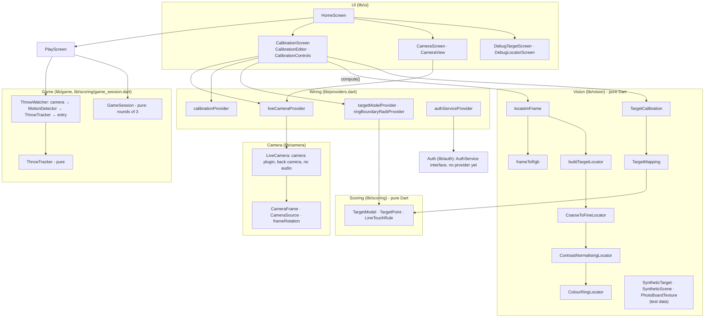

# System Diagram

Thrower App runs entirely on the phone (no backend yet; see [[Design Decisions]] → User Accounts Required). Four layers, each depending only on the ones below it. The UI reaches every layer through Riverpod providers (`lib/providers.dart`), so tests can swap any layer for a fake.

**Rules:**
- `lib/vision` and `lib/scoring` have **no Flutter imports**. They run in background isolates and in tests on a PC.
- Vision depends on the camera layer's **data** types (`CameraFrame`) only, never on the camera plugin.
- Heavy work (frame conversion, ring finding) runs off the UI thread via `compute`, using top-level functions and plain data. See [[Known Issues]] → Isolate Fails.

See [[Data Flow]] for one frame's path to a score, and [[Glossary]] for the component → function tree and terms.
